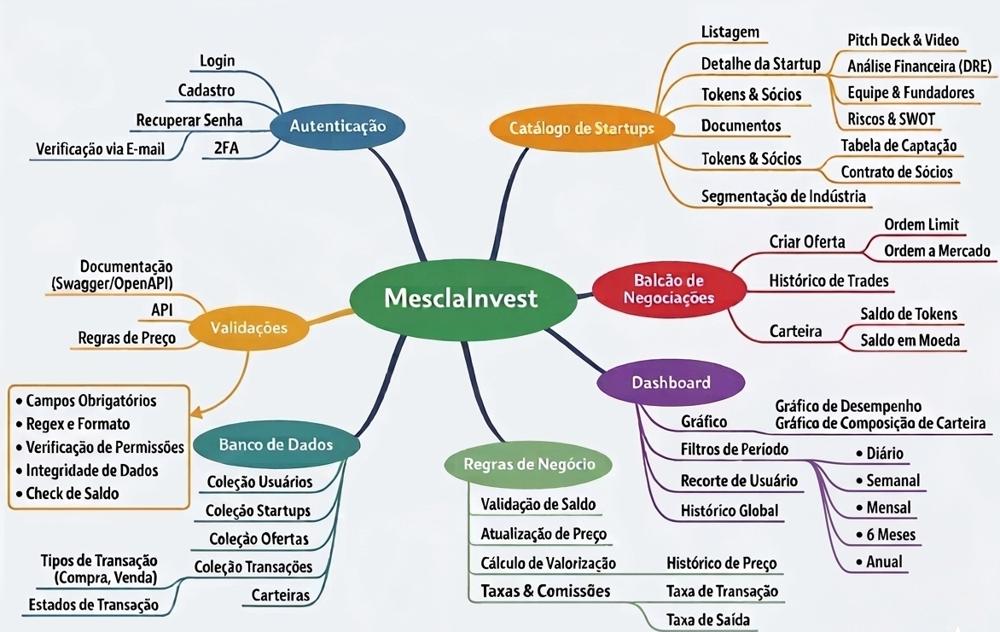

# ES-PI3-2026-T2-G10
Aplicativo mobile de investimentos desenvolvido em Flutter como parte do projeto Mescla. O app permite acompanhar investimentos, visualizar informações financeiras e explorar recursos voltados à organização e análise de aplicações.

## 🧑 Integrantes

- GUSTAVO LIEB FIGUEIRA
- LEONARDO DIONEL LIMA SILVA
- Luis Felipe Pontes Mita
- MATHEUS HENRIQUE PORTUGAL NARDUCCI
- YURI SOARES DA SILVA

## 🛠 Organização Inicial do Projeto
Para iniciar o desenvolvimento do aplicativo de investimentos do projeto **Mescla**, foram criadas as primeiras *issues* no repositório com o objetivo de organizar o trabalho da equipe, definir responsabilidades e estruturar o planejamento inicial do projeto.

A equipe é composta por **5 integrantes**, e o desenvolvimento foi dividido em três principais áreas:

- **Frontend** - Desenvolvimento da interface do aplicativo e experiência do usuário.
- **backend** - Desenvimento da lógica de aplicação, APIs e regras de negócio.
- **Banco de Dados** - Modelagem, estrutura e gerencimento de dados do sistema.
  
## Distribuição inicial de responsabilidades

| Integrante | Área de Responsabilidade | Atividades |
|-------------|--------------------------|-------------|
| Gustavo Lieb | Frontend | Desenvolvimento das telas principais e navegação do aplicativo |
| Leonardo Dionel | Frontend | Componentes de interface, integração com APIs |
| Yuri Soares | Backend | Desenvolvimento da API e regras de negócio |
| Matheus Henrique | Integração / Backend | Integração entre frontend, backend e banco de dados |
| Luis Felipe | Banco de Dados | Modelagem do banco de dados e estrutura das tabelas |

##  Mapa Mental MesclaInvest

## 💻 Issues Inicias do Projeto

As seguintes *issues* foram criadas para estruturar o início do projeto:

### Issue #1 - Organização do Repositório
- Definir estrutura inicial do projeto Flutter
- Criar README
- Definir padrão de commits
- Organização pastas do projeto

### Issue #2 - Planejamento das Funcionalidades
- Definir escopo inicial do aplicativo
- Listar funcionalidades principais do app de investimentos
- Criar backlog inicial do projeto

### Issue #3 - Definição de Arquitetura
- Definir a comunicação entre frontend e backend
- Escolher pad~rao de arquitetura
- Planejar estruturas de APIs

### Issue #4 - Modelagem do Banco de Dados
- Definir lingugaem de Banco de Dados
- Definir entidades principais
- Criar modelo conceitual
- Estruturar tabelas e relacionamentos

### Issue #5 - Estrutura Inicial do Frontend
- Criar estrutura de telas no Flutter
- Definir navegação entre elas
- Criar layout inicial do aplicativo

### Issue #6 - Configuração do Backend
- Criar estrutura inicial do backend
- Definir endpoints principais da API
- Configurar ambiente de desenvolvimento

